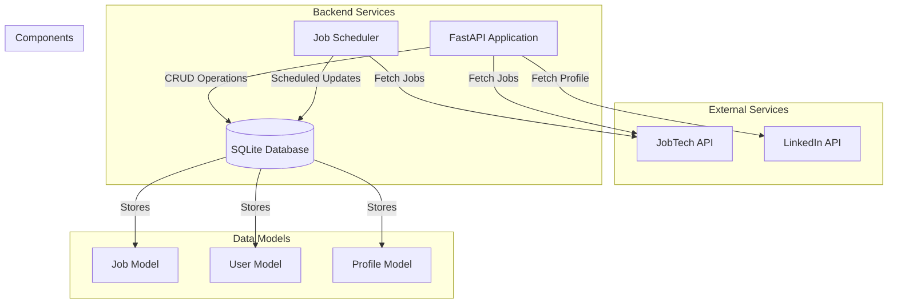

# LinkedIn Feed Backend Architecture

## System Overview

## Component Details

### 1. External Services
- **JobTech API**: External service for job listings and search
- **LinkedIn API**: External service for profile data and authentication

### 2. Backend Services
- **FastAPI Application**: Main application server handling HTTP requests
- **SQLite Database**: Local database for storing job and user data
- **Job Scheduler**: Automated service for job updates and cleanup

### 3. Data Models
- **Job Model**: Stores job listings with details like title, description, company, etc.
- **User Model**: Manages user authentication and preferences
- **Profile Model**: Stores LinkedIn profile data

## Data Flow

1. **Job Updates**:
   - Scheduler runs daily at 8:00 AM
   - Fetches new jobs from JobTech API
   - Updates existing jobs in database
   - Cleans up old jobs at 9:00 AM

2. **API Endpoints**:
   - `/search`: Search jobs with filters
   - `/jobs/{job_id}`: Get specific job details
   - `/profile`: Get LinkedIn profile data
   - `/auth`: Handle authentication

3. **Database Operations**:
   - CRUD operations for jobs
   - User authentication and management
   - Profile data storage and retrieval

## Technical Stack

- **Backend Framework**: FastAPI
- **Database**: SQLite with SQLAlchemy ORM
- **Scheduling**: Cron jobs
- **Authentication**: OAuth2 with LinkedIn
- **API Client**: JobTech API client
- **Logging**: Python logging module

## Security

- OAuth2 authentication for LinkedIn integration
- API key management for JobTech API
- Secure session management
- Input validation and sanitization

## Monitoring and Logging

- Application logs in `logs` directory
- Error tracking and reporting
- Performance monitoring
- Job update and cleanup logs

## Deployment

- Local development environment
- Cron jobs for scheduled tasks
- SQLite database for data persistence
- FastAPI server for API endpoints 